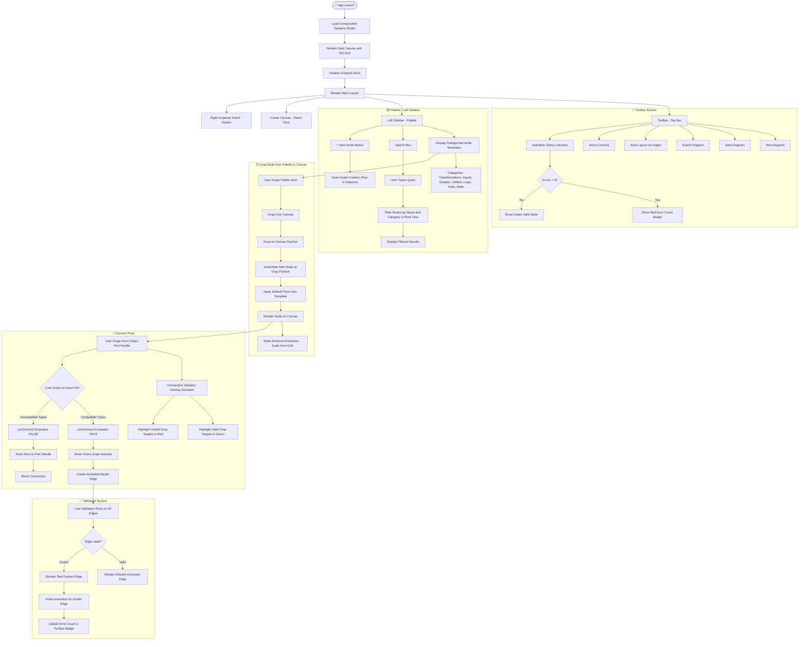

# Composable Systems Studio

_A visual typed wiring diagram editor for composable transformations_

---

## 1. Summary

Composable Systems Studio is a production-ready visual programming environment for developers, architects, and systems thinkers who need to model typed, composable transformations. Inspired by category theory wiring diagrams and tools like Unreal Blueprints and Node-RED, it lets users wire together typed nodes representing real transformations — not generic flowchart boxes. The target audience is technical users building data pipelines, workflow systems, application architectures, and creative process diagrams.

---

## 2. Design Archetype

**Glassmorphism / HUD — Dev Tool Dark Mode**

This archetype fits because the tool is a professional developer instrument. The aesthetic draws from Unreal Engine's Blueprint editor, Linear's precision UI, and Raycast's command-driven dark interface. Deep dark backgrounds, glowing typed port handles, translucent panel surfaces, and neon-coded type colors create an environment that feels powerful and purposeful — not decorative.

---

## 3. Key Components

- **Toolbar (top bar):** App title/logo, global actions (New, Save, Export, Auto-Layout via Dagre), zoom controls, and a validation status indicator showing error count.
- **Left Sidebar — Palette:** Searchable, categorized list of draggable node templates. Categories: Transformations, Inputs, Outputs, Utilities, Logic, Data, State. Each item shows node name, type badge, and port count preview.
- **Center Canvas:** React Flow canvas with custom nodes, animated edges, minimap, pan/zoom, background dot grid, and fitView controls. This is the primary workspace.
- **Custom Node:** Displays title, type badge, input ports (left side), output ports (right side). Each port is color-coded by data type. Ports show label and type on hover. Selected state has a glowing border.
- **Port Handle:** Circular handle per port, color-coded by type (e.g., string = blue, number = amber, ingredient = green, event = purple). Incompatible connection attempts flash red.
- **Right Inspector Panel:** Context-sensitive editor for the selected node. Editable fields: label, description, node type, input port list (add/remove/edit), output port list, port data types, cardinality, required flag, and metadata key-value pairs.
- **Connection Validator Overlay:** Visual feedback layer that highlights valid drop targets in green and invalid ones in red during a drag-connect gesture.
- **Node Editor (within Inspector):** Inline form for editing individual port definitions — label, dataType dropdown, cardinality (one/many), required toggle.

---

## 4. Core Interactions

- **Drag from Palette to Canvas:** User drags a palette item onto the canvas; a new node is instantiated at drop position with default ports from the template.
- **Connect Ports:** User drags from an output port handle to an input port handle. `canConnect(sourcePort, targetPort)` is evaluated — compatible types show a green snap indicator; incompatible types show a red flash and block the connection.
- **Select Node:** Clicking a node populates the right Inspector with that node's full editable model. Canvas node updates reactively as Inspector fields change.
- **Edit Node in Inspector:** User edits label, description, adds/removes ports, changes port types. Changes propagate immediately to the canvas node via Zustand store.
- **Delete Node or Edge:** Backspace/Delete key removes selected node(s) or edge(s). Confirmation for nodes with active connections.
- **Search Palette:** Typing in the palette search box filters nodes by name and category in real time.
- **Add Custom Node:** A "+ New Node" button in the palette or toolbar opens a creation flow in the Inspector to define a brand-new node type from scratch.
- **Auto-Layout:** Toolbar button runs Dagre layout algorithm to automatically arrange nodes into a clean left-to-right directed graph.
- **Validation Feedback:** The toolbar shows a live count of type-incompatible connections. Invalid edges are rendered in red with a dashed style.
- **Zoom / Pan / Minimap:** Standard React Flow controls — scroll to zoom, drag to pan, minimap for navigation in large diagrams.

---

## 5. Visual Direction

**Overall vibe:** Precision dark-mode dev tool. Feels like a cross between a circuit board editor and a high-end IDE. Deep, near-black backgrounds with subtle blue-tinted depth. Panels are slightly lighter with frosted glass translucency. Neon-coded port colors create a type-system language that is instantly readable. Motion is purposeful — nodes snap, edges animate their flow direction, validation feedback pulses.

### Color Palette

| Element | Color |
|---|---|
| Canvas background | `#0d0f14` — deep navy-black with dot grid in `#1e2330` |
| Panel surfaces | `#13161f` with `1px` borders in `#1f2535`, slight backdrop blur |
| Accent / interactive | Electric blue `#3b82f6` — selection states, active handles, focus rings |
| Valid connection | Glowing green `#22c55e` |
| Invalid connection | Pulsing red `#ef4444` |

### Port Type Colors

| Type | Color |
|---|---|
| string | `#60a5fa` (blue) |
| number | `#f59e0b` (amber) |
| boolean | `#a78bfa` (violet) |
| event | `#c084fc` (purple) |
| ingredient | `#34d399` (emerald) |
| liquid | `#22d3ee` (cyan) |
| heat | `#f97316` (orange) |
| signal | `#fb7185` (rose) |
| object | `#94a3b8` (slate) |

### Typography

| Role | Font |
|---|---|
| Display / Labels | `Space Grotesk` — geometric, technical, confident. Node titles, panel headers, type badges. |
| UI / Body (code-adjacent) | `JetBrains Mono` — monospace for port type labels, metadata keys. |
| Secondary UI | `Outfit` — clean, modern sans for descriptions, helper text, form labels. |

### Component Styling

- **Node cards:** Rounded `8px`, dark surface `#1a1f2e`, `1px` border, subtle drop shadow. Selected nodes get a `2px` glowing blue border with a soft outer glow.
- **Edges:** Smooth bezier curves, animated dash flow for active connections, color-coded to the source port type, red dashed for invalid connections.
- **Motion:** Nodes entrance with a subtle scale-up from `0.95`. Palette items hover with a slight left-indent and background highlight. Inspector panels slide in from the right. Validation errors pulse once then settle.

> **Key design principle:** Every visual element should communicate system information — port colors encode types, edge styles encode validity, node borders encode selection state. The UI is a live diagram of the type system itself, not just a drawing tool.

---

## 6. User Flow (Mermaid Diagram)

